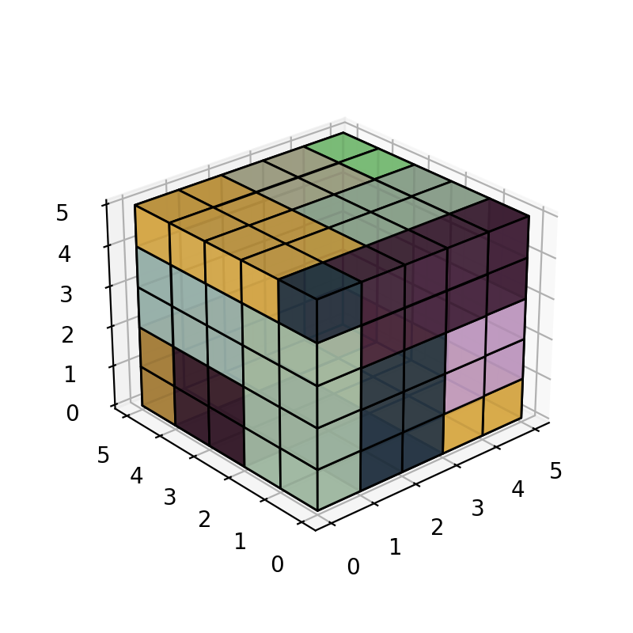

# Toto cube solver
Computational solution to toto's cube puzzle.

## Context
Too long ago my cousin *Toto* challenge me to solve a cube puzzle. Every one who tryed it failed. Seems destiny did not want me to see the puzzle solved.

Until friday June 4th 2021, the day of the **GB** reunion after a year and a half of social distancing due to COVID, my friend [Frankie](franktrillo@ciencias.unam.mx) and I tried to find the longed for solution computationally.

## Solution
This solution was found Friday December 3th 2021, the symetry group of the solution is non trivial, all faces are the same up to isometries, and all unitary cubes lie on the symetry rotation's axis. A [numpy array](solution/solution.npy) with the solution can be found in this repo, along with some [images](solution) rendered with *matplotlib*.

  

# Run solver
To run the solution do

    $ python solve_cube.py
